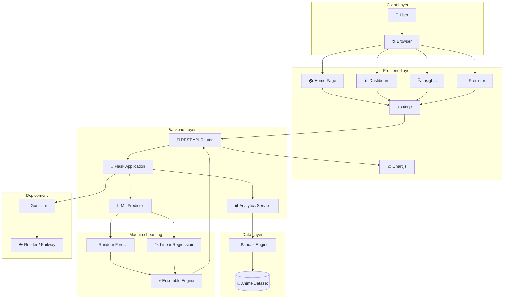

<div align="center">


<br/>

### 🎌 Anime Box Office Intelligence Platform

**By [Ajinkya Ghuge](https://github.com/ajinkya)**

*A full-stack data analytics + ML web app that decodes the anime industry's box office, ratings, and studio performance across 40+ years of data.*

<br/>

[](https://python.org)
[](https://flask.palletsprojects.com)
[](https://pandas.pydata.org)
[](https://scikit-learn.org)
[](https://chartjs.org)

<br/>

> *"The data doesn't lie — but it takes the right question to make it speak."*

</div>

---

## 📸 Live Preview

<table>
<tr>
<td width="50%">

**🏠 Home Page**
.png)

</td>
<td width="50%">

**📊 Analytics Dashboard — KPI Cards**
.png)

</td>
</tr>
<tr>
<td width="50%">

**🔍 Deep Insights — Rating vs Box Office Correlation**
.png)

</td>
<td width="50%">

**📈 Dashboard — Revenue, Genre & Studio Charts**
.png)

</td>
</tr>
<tr>
<td width="50%">

**🗃️ Data Explorer**
.png)

</td>
<td width="50%">

**📉 Dashboard — Top 15 Grossing Anime**
.png)

</td>
</tr>
</table>

> **▶ Run locally:** `python app.py` → open `http://localhost:5000`

---

## 📋 Table of Contents

| # | Section |
|---|---------|
| 1 | [Project Overview](#-project-overview) |
| 2 | [Key Analytical Findings](#-key-analytical-findings) |
| 3 | [Features](#-features) |
| 4 | [Architecture](#-architecture) |
| 5 | [Tech Stack](#-tech-stack) |
| 6 | [Dataset](#-dataset) |
| 7 | [Machine Learning](#-machine-learning) |
| 8 | [API Reference](#-api-reference) |
| 9 | [Project Structure](#-project-structure) |
| 10 | [Installation](#-installation) |
| 11 | [Usage Guide](#-usage-guide) |

---

## 🎯 Project Overview

**AnimeX Analytics** is a production-ready web application tracking the global box office performance of **80 anime titles** spanning **1984 to 2022**. It combines traditional EDA with machine learning prediction — all wrapped in a custom anime-themed dark UI.

The platform answers real industry questions:

| ❓ Question | 💡 Insight Provided |
|---|---|
| Which studios have the best ROI? | Studio radar + profitability rankings |
| Does MAL score = box office? | Pearson correlation scatter (spoiler: r = 0.18) |
| Which genres dominate globally? | Genre bubble chart + revenue breakdown |
| What will a new anime gross? | ML ensemble predictor with confidence range |

---

## 📊 Key Analytical Findings

<div align="center">

| 🏆 Metric | 📈 Value |
|---|---|
| Total industry revenue tracked | **$7.95B+** |
| Highest grossing title | **Dragon Ball Z** — $750M |
| Best ROI ever | **Your Name** — 152× ($2.5M → $380M) |
| MAL–Box Office correlation | **r = 0.18** (weak positive) |
| Top studio by revenue | **Toei Animation** |
| Blockbusters (>$200M) | **9 titles** |
| Fastest growing decade | **2010s** |

</div>

---

## ✨ Features

AnimeX Analytics is built around **4 core modules**:

<details>
<summary><b>📊 Module 1 — Live Dashboard</b></summary>

<br/>

Interactive analytics dashboard with **6 KPI cards** and **5 Chart.js visualisations**.

**KPI Cards tracked:**
- 💰 Total industry box office
- 🥇 Highest grossing anime title
- ⭐ Average MAL score across dataset
- 🚀 Maximum ROI champion
- 🎬 Studios covered
- 💥 Blockbuster count (titles exceeding $200M)

**Charts included:**

| Chart | Type | Description |
|---|---|---|
| Top 15 Grossing Anime | Horizontal bar | Cyan-to-magenta gradient, sorted by revenue |
| Revenue Trend by Year | Dual-axis line | Revenue ($M) + avg MAL score, 1984–2022 |
| Revenue by Genre | Vertical bar | 12 genres compared |
| Studio Performance | Grouped horizontal bar | Revenue vs Profit, top 10 |
| Success Tier Distribution | Doughnut | Blockbuster / Hit / Solid / Moderate split |

**Filters:** Genre • Studio • Sort-by • Full text search

</details>

<details>
<summary><b>🔍 Module 2 — Deep Insights</b></summary>

<br/>

Statistical analysis and correlation study page.

- **Scatter Plot** — Rating vs Box Office with Pearson r displayed
- **ROI Champions Table** — *Your Name* tops at **152×** ROI
- **Genre Bubble Chart** — Bubble size = title count; axes = avg MAL score vs avg revenue
- **Industry Growth by Decade** — Animated decade cards from 1980s → 2020s
- **Studio Radar Chart** — Top 5 studios compared across 5 dimensions
- **Movies vs Series** — Avg revenue, score, budget, and ROI multiplier comparison

</details>

<details>
<summary><b>🤖 Module 3 — ML Box Office Predictor</b></summary>

<br/>

A trained ML ensemble that forecasts box office revenue from user inputs.

**Inputs:**

| Parameter | Range |
|---|---|
| Format | Movie / Series |
| Primary Genre | 13 genres |
| Studio | 32 studios |
| Production Budget | $0.5M – $80M |
| Expected MAL Score | 5.0 – 10.0 |
| Expected IMDb Score | 4.0 – 10.0 |
| Release Year | 1984 – 2027 |
| Episodes (series only) | 1 – 500 |

**Output:** Ensemble predicted box office • Individual RF + LR predictions • ±20% confidence range • Estimated ROI % • Success tier • Feature importance chart • R² + MAE metrics

</details>

<details>
<summary><b>🗂️ Module 4 — Data Explorer</b></summary>

<br/>

Full searchable, sortable, filterable data table of all 80 anime titles.

**Columns:** Rank • Title • Year • Genre badge • Studio • Box Office • Budget • ROI • MAL Score (mini progress bar) • Success Tier badge

**Features:** Real-time text search • Multi-filter • Click-to-sort • Asc/desc toggle

</details>

---

## 🏗️ Architecture





## 🏗️ Request Flow

```mermaid
sequenceDiagram
    actor User
    participant Browser
    participant JS as utils.js
    participant API as Flask API
    participant Service as Analytics Service
    participant ML as ML Predictor
    participant Data as Pandas Dataset
    participant Chart as Chart.js

    User->>Browser: Open Dashboard
    Browser->>JS: Load UI Components
    JS->>API: GET /api/analysis
    API->>Service: Request Analytics Data
    Service->>Data: Query Dataset
    Data-->>Service: Aggregated Results
    Service-->>API: KPI + Chart Data
    API-->>JS: JSON Response
    JS->>Chart: Render Charts
    Chart-->>User: Interactive Visualizations

    User->>Browser: Submit Prediction
    Browser->>JS: Prediction Form Data
    JS->>API: POST /api/predict
    API->>ML: Generate Prediction
    ML-->>API: Revenue Forecast
    API-->>JS: Prediction JSON
    JS-->>User: Display Results
## 🛠️ Tech Stack

### Backend

| Library | Version | Purpose |
|---|---|---|
| **Flask** | 3.0+ | Web framework, REST API, static file serving |
| **Pandas** | 2.0+ | Dataset construction, filtering, aggregation |
| **NumPy** | 1.24+ | Numerical ops, log transforms, normalisation |
| **scikit-learn** | 1.3+ | RandomForest, LinearRegression, LabelEncoder, StandardScaler |
| **Gunicorn** | 21.0+ | Production WSGI server |

### Frontend

| Technology | Purpose |
|---|---|
| **Vanilla JS (ES6+)** | Pure fetch API, no framework overhead |
| **Chart.js 4.4** | Bar, line, scatter, bubble, doughnut, radar charts |
| **CSS Custom Properties** | Design tokens — colours, spacing, fonts, animations |
| **Google Fonts** | Orbitron (headings) + Exo 2 (body) |
| **CSS backdrop-filter** | Glassmorphism card effect |

### Design System

> **Dark Neon-Katana** theme — anime images + animated GIFs at 16–18% opacity as background

```
Background:   rgba(13, 20, 40, 0.85) + backdrop-filter: blur(12px)
Accent cyan:  #00f5ff
Accent pink:  #ff00aa
Gold:         #ffd700
Green:        #00ff88
Animations:   Ken Burns • floatUp • scanline sweep • particle system
```

---

## 📦 Dataset

### Source & Construction

Built programmatically using real public data from **MyAnimeList**, **Box Office Mojo**, and **Wikipedia**.

**80 anime titles** | **1984 – 2022** | Movies + Series

### Schema

| Column | Type | Description |
|---|---|---|
| `title` | str | Anime title |
| `year` | int | Release year |
| `genre` / `primary_genre` | str | Genre (full + first only) |
| `studio` | str | Production studio |
| `budget_m_usd` | float | Production budget ($M) |
| `box_office_m_usd` | float | Global box office revenue ($M) |
| `mal_score` / `imdb_score` | float | Rating scores (0–10) |
| `episodes` | int | Episode count (1 = movie) |
| `type` | str | "Movie" or "Series" |
| `profitability` | float | box_office ÷ budget (ROI ratio) |
| `profit_m_usd` | float | box_office − budget |
| `popularity_index` | float | 60% revenue + 40% MAL, normalised 0–100 |
| `decade` | str | e.g. "2010s" |
| `success_tier` | str | Blockbuster / Hit / Solid / Moderate |
| `rank` | int | Rank by box office |

### Feature Engineering

```python
# Profitability ratio
df["profitability"] = df["box_office_m_usd"] / df["budget_m_usd"]

# Composite popularity index
df["popularity_index"] = (0.6 * normalize(box_office) + 0.4 * normalize(mal_score)) * 100

# Success tier thresholds
# Blockbuster → box_office >= $200M
# Hit         → box_office >= $50M
# Solid       → box_office >= $10M
# Moderate    → box_office < $10M
```

---

## 🤖 Machine Learning

### Model Architecture

```
Prediction = 0.70 × RandomForest + 0.30 × LinearRegression
```

**Why ensemble?**
- Random Forest → captures non-linear interactions (budget × franchise × year)
- Linear Regression → regularising baseline, prevents extreme outlier predictions

### Feature Set (11 features)

| Feature | Engineering |
|---|---|
| `budget_m_usd`, `mal_score`, `imdb_score`, `year`, `episodes` | Raw values |
| `is_movie` | Binary — derived from type |
| `genre_encoded`, `studio_encoded` | LabelEncoder |
| `years_since_2000` | `max(year - 2000, 0)` |
| `score_product` | `mal_score × imdb_score` (interaction) |
| `budget_squared` | `log1p(budget_m_usd)` |

### Training Details

```python
# Log-transform target (right-skewed distribution)
y = np.log1p(df["box_office_m_usd"])

# Random Forest config
RandomForestRegressor(
    n_estimators=200,
    max_depth=8,
    min_samples_split=3,
    random_state=42,
    n_jobs=-1
)

# Confidence interval
confidence_low  = ensemble * 0.80
confidence_high = ensemble * 1.20

# Train/test split: 80/20
```

---

## 📡 API Reference

All endpoints return `{ "status": "ok", "data": ... }`.

### Anime Endpoints

| Method | Endpoint | Description |
|---|---|---|
| `GET` | `/api/anime` | All anime — params: `search`, `genre`, `studio`, `sort_by`, `order`, `limit` |
| `GET` | `/api/anime/filters` | Available filter options (genres, studios, years) |

### Analysis Endpoints

| Method | Endpoint | Description |
|---|---|---|
| `GET` | `/api/analysis` | Full analysis bundle (all chart data) |
| `GET` | `/api/analysis/kpis` | KPI summary cards |
| `GET` | `/api/analysis/top-grossing` | Top N by box office — param: `n` (default 15) |
| `GET` | `/api/analysis/trends` | Yearly revenue and score trends |
| `GET` | `/api/analysis/genres` | Genre breakdown |
| `GET` | `/api/analysis/studios` | Studio performance comparison |
| `GET` | `/api/analysis/correlation` | Scatter data + Pearson r values |
| `GET` | `/api/analysis/profitability` | Top ROI leaders |

### Prediction Endpoints

| Method | Endpoint | Description |
|---|---|---|
| `POST` | `/api/predict` | Predict box office from inputs |
| `GET` | `/api/predict/model-info` | Model metrics, feature importance, studio/genre lists |

### Example

```bash
curl -X POST http://localhost:5000/api/predict \
  -H "Content-Type: application/json" \
  -d '{
    "genre": "Action",
    "budget_m": 15.0,
    "mal_score": 8.5,
    "imdb_score": 8.0,
    "year": 2024,
    "is_movie": true,
    "studio": "ufotable",
    "episodes": 1
  }'
```

```json
{
  "status": "ok",
  "data": {
    "predicted_box_office_m_usd": 187.4,
    "random_forest_prediction": 195.2,
    "linear_regression_prediction": 168.8,
    "confidence_low": 149.9,
    "confidence_high": 224.9,
    "success_tier": "Hit",
    "roi_estimate": 1149.3,
    "model_r2": 0.8521
  }
}
```

---

## 📁 Project Structure

```
anime-analytics/
│
├── app.py                      # Flask application factory, route registration
├── requirements.txt            # Python dependencies
├── Procfile                    # Gunicorn deployment config
├── anime_dataset.csv           # Pre-built dataset export
│
├── data/
│   └── dataset_builder.py      # 80-entry dataset + feature engineering
│
├── services/
│   └── analytics.py            # EDA logic — KPIs, aggregations, chart data
│
├── ml/
│   └── predictor.py            # ML ensemble (RandomForest + LinearRegression)
│
├── routes/
│   └── api.py                  # Flask Blueprint — all /api/* endpoints
│
├── templates/
│   ├── index.html              # Home — hero, feature cards, top 10
│   ├── dashboard.html          # KPIs + 5 charts + data table
│   ├── insights.html           # Correlation, ROI, decades, radar
│   └── predict.html            # ML predictor form + results
│
└── static/
    ├── css/main.css            # Full design system — tokens, components, animations
    ├── js/utils.js             # Shared JS — API helper, Chart.js defaults, nav
    └── images/                 # Anime images + GIF backgrounds
```

---

## ⚡ Installation

### Prerequisites
- Python 3.10+
- pip

```bash
# 1. Clone / download the project
cd anime-analytics

# 2. Create and activate a virtual environment
python -m venv venv

# Windows
venv\Scripts\activate

# macOS / Linux
source venv/bin/activate

# 3. Install dependencies
pip install -r requirements.txt

# 4. Run the app
python app.py
```

Open **http://localhost:5000** in your browser.

### Production Deployment

```bash
# Gunicorn
gunicorn app:app --bind 0.0.0.0:$PORT --workers 2
```

Procfile already configured for **Heroku / Railway**:
```
web: gunicorn app:app --bind 0.0.0.0:$PORT
```

---

## 📖 Usage Guide

<details>
<summary><b>📊 Dashboard</b></summary>

1. Open `/dashboard`
2. Use **Genre** and **Studio** dropdowns to filter all charts simultaneously
3. Change **Sort By** to reorder the data table
4. Scroll to the **Full Dataset** table — click any column header to sort
5. Use the search box for instant text search across title and studio

</details>

<details>
<summary><b>🔍 Insights</b></summary>

1. Open `/insights`
2. The **scatter plot** shows every anime as a dot — hover for title and revenue
3. **ROI Champions** lists the best investments in anime history
4. The **decade chart** shows industry growth from the 1980s to 2020s
5. The **radar chart** compares the top 5 studios across 5 dimensions

</details>

<details>
<summary><b>🤖 Predictor</b></summary>

1. Open `/predict`
2. Select **Movie** or **Series** format
3. Choose **Genre** and **Studio**
4. Drag sliders for **Budget**, **MAL Score**, **IMDb Score**, and **Year**
5. For Series, set the **Episodes** slider
6. Click **Predict Box Office**
7. Right panel shows: ensemble result, individual model predictions, ROI, and tier
8. **Feature Importance** chart shows which inputs the model weights most

</details>

---

<div align="center">

## 👤 Author

**Ajinkya Ghuge**

Built with Flask • Pandas • scikit-learn • Chart.js

Data sourced from MyAnimeList, Box Office Mojo, and Wikipedia.

<br/>

⭐ **If this project helped you, give it a star!** ⭐

<br/>

*"The data doesn't lie — but it takes the right question to make it speak."*

</div>
